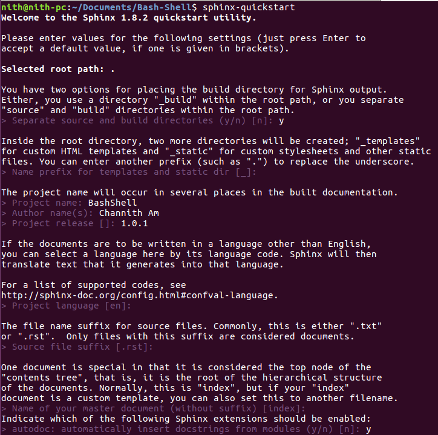
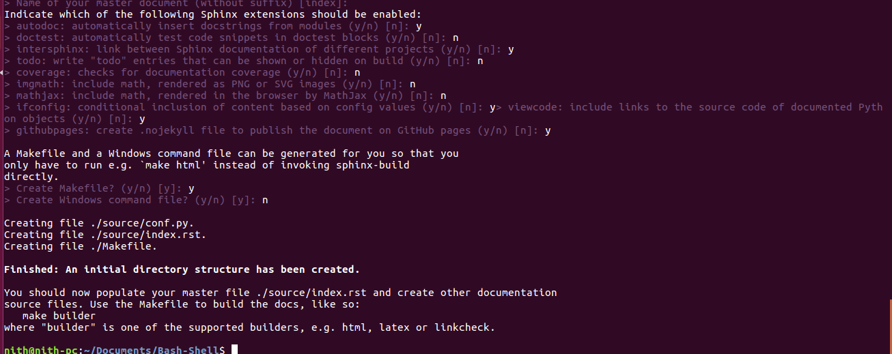
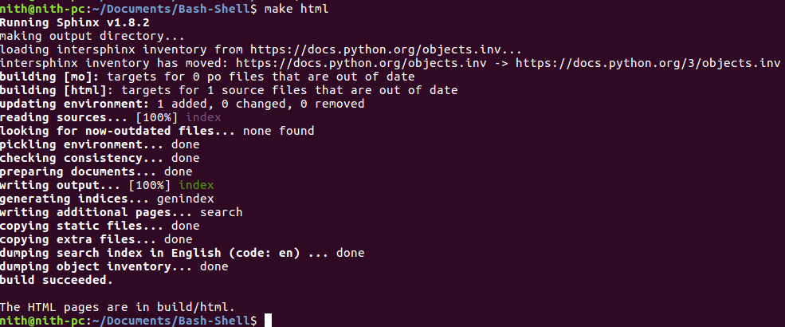
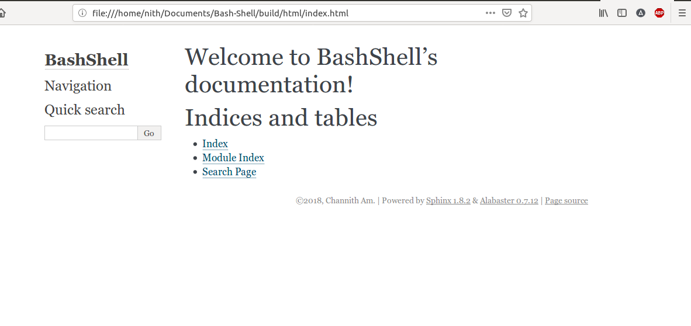

# រៀបចំproject ឫឯកសារជាមួយ*Sphinx*

នេះជាអត្ថបទខ្លីមួយលើរបៀបរៀបចំគំរោង ឫឯកសារ​ (code)ជាមួយSphinx និងRinohtype។

នេះក៏ប្រហែលជាអ្វីដែលអ្នកនឹងដឹងពីខ្ញុំនៅពេលដែលខ្ញុំជានិសិត្សទូរគមនាគមន៍ និងអេឡិចត្រូនិច្ចដំបូង។ ខ្ញុំរកឃើញថាការ
សរសេរឯកសារ(កូដ)គួអោយធុញទ្រាន់ និងគ្មានប្រយោជន៍ព្រោះជាអ្វីដែលខ្ញុំបានដឹងពីអ្វីដែលកូដ(code)របស់ខ្ញុំធ្វើហើយ 
មានតែមនុស្សម្នាក់គត់ដែលប្រហែលជាអានវាជាអ្នកពិនិត្យមើលវា។

ខ្ញុំមិនយល់ពីសារៈសំខាន់របស់វារហូតដល់ថ្ងៃមួយខ្ញុំត្រូវត្រួតពិនិត្យមើលក្រដាសដែលមិនមាន​ឯកសារ ដែលខ្ញុំមិនបានសរសេរពីប៉ុន្មានឆ្នាំមុនមកសំរាប់ជាឯកសារយោង ហើយជំនួសអោយការមើលរំលងពីវា។ ខ្ញុំចំនាយពេល
ច្រើនក្នុងការយល់ច្រឡំអំពីរបៀបដែលខ្ញុំបានរៀបចំគម្រោង និងសូម្បីតែរបៀបដំណើរការវា។

សព្វថ្ងៃនេះ មានឧបករណ៍ជាច្រើនដែលអាចរកបាន ដើម្បីជួយយើងក្នុងការសរសេរឯកសារកូដ។ ថ្មីៗនេះ ខ្ញុំបានរៀនពី
ឧបករណ៍ដែលធ្វើឪ្យខ្ញុំមានភាពងាយស្រួលក្នុងការបង្កើតឯកសារដែលមានភាពឆ្លាតវៃ និងស្រស់ស្អាត។ ពីរក្នុងចំនោម
នោះ គឺ **Sphinx** និង**Rinohtype**។

Sphinx ដែលសរសេរដោយ Georg Brandl និងត្រូវបានផ្ដល់អាជ្ញាបណ្ណក្រោមអាជ្ញាបណ្ណ `BSD` ត្រូវបានបង្កើើតឡើងដំបូង
សំរាប់ឯកសារ កូដPython ហើយជាកន្លែងដ៏ប្រសើរបំផុតសម្រាប់ការចងក្រងឯកសារកម្មវិធីជាច្រើនភាសា (sphinx-doc.org, 2018)។

Rinohtype ជាគូជាមួយSphinxផ្ដល់ជម្រើសទំនើប ជំនួសទៅនឹងLatex។ វាផ្ដល់នូវកម្មវិធីbackendរបស់Sphinx ដែលអនុញ្ញាតឪ្យបង្កើតជាឯកសារមានទម្រង់​ PDF ប្រកបដោយវិជ្ជាជីវៈ (Machiels)។

នៅក្នុងមេរៀននេះខ្ញុំនឹងប្រើSphinx និងRinohtypeដើម្បីបង្កើតឯកសារ HTML និងPDF ទៅAPI project ដ៏សាមញ្ញមួយ
ដែលខ្ញុំសរសេរគ្រប់កំណត់ត្រាគំរោង។
## 1. Installation

```
$ sudo apt-get update
$ sudo apt-get install python-pip python-dev
$ pip install Sphinx
$ pip3 install rinohtype
```

ប្រសិនបើជួបerror:

```
Traceback (most recent call last):
  File "/usr/local/bin/pip", line7, in <module>
      from pip._internal import main
ImportError: No module named _internal
```

យើងត្រូវ edit file `/usr/local/bin/pip` ខាងក្រោម:
> change the from pip._internal import main into from pip import main and Voila! Problem dismissed.


## 2. បង្កើតទីតាំងឯកសារបស់អ្នក

```
$ cd Your_Doc_Directory
$ mkdir docs # ឈ្មោះអីដែលអ្នកចង់
$ cd docs
```

## 3. Setup Sphinx

```
$ sphinx-quickstart
```




សាកមើល!!!



ឥឡូវនេះចូលទៅកាន់ ~/Bash-Shell/build/html រួចបើក file index.html ដោយbrowserណាមួយ។ អ្នកនឹងឃើញ៖




https://medium.com/@richyap13/a-simple-tutorial-on-how-to-document-your-python-project-using-sphinx-and-rinohtype-177c22a15b5b
